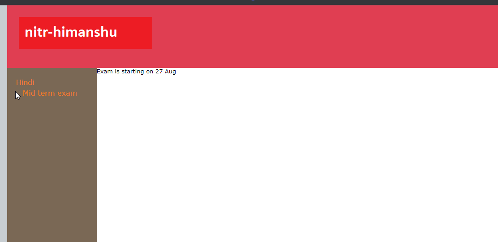
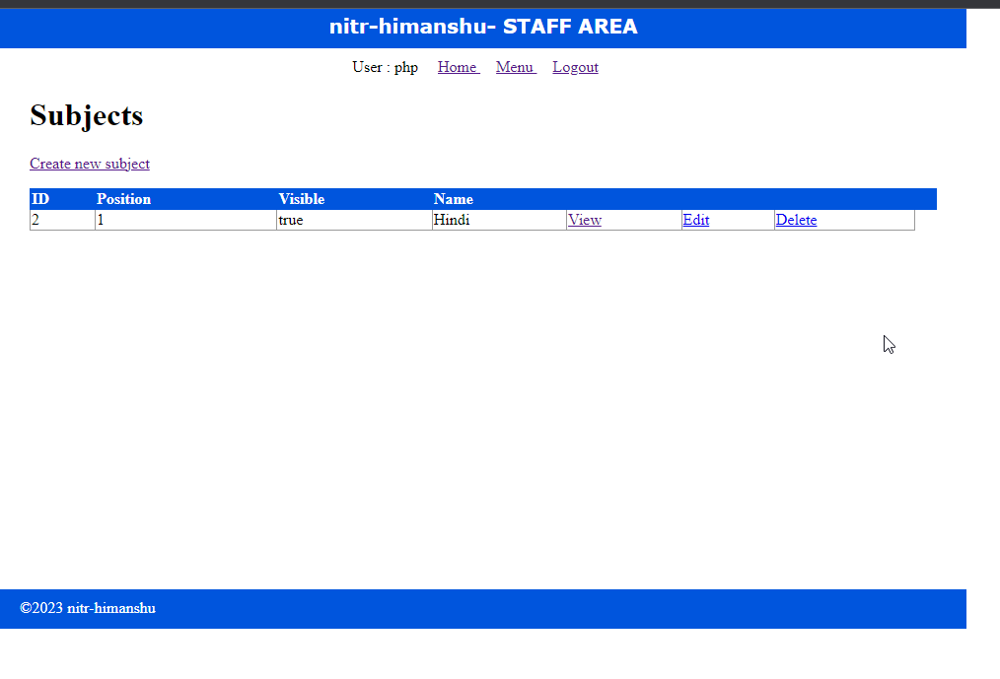

# learn_php

## School website


A sample website for a school with dynamic content loading.
Instead of static contents, this website loads dynamically from the database.

For update the content, an admin panel is created.

Admin can

- Add different subjects
- Under different subjects he can add different pages.
- for a page, he can add content
- admin can also edit, delete the subjects and page
- Also user can hide/show pages or subjects

## Setup

In order to run this, we need to install XAMPP

- XAMPP 8.2.0

```git
git clone git@github.com:nitr-himanshu/learn_php.git
```

- copy the project in C:\xampp\htdocs\school
- start Apache server
- start MySql
- create a new database **learnphp**
- import ./private/learnphp.sql
- localhost/school/public

## Admins



- url - localhost/school/public/staff/login.php
- username : php
- password : himanshu
